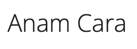
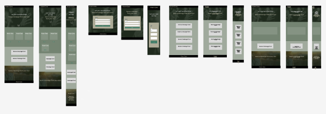
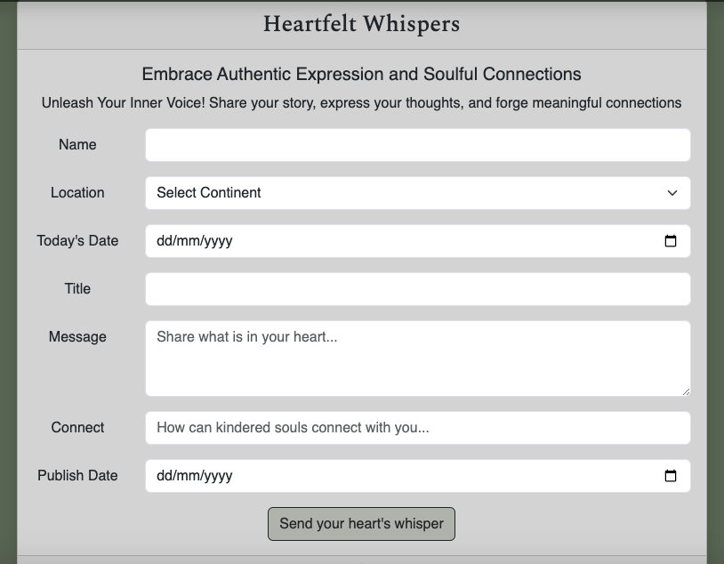

# Anam Cara

<h1 align="center"></h1>

 Live website

 GitHub Repository

 GitHub Repository

# Welcome to Anam Cara!

The term **"Anam Cara"** originates from the Irish Gaelic language. "Anam" meaning "soul," and "Cara" meaning "friend." 

Rooted in Celtic spirituality and philosophy, particularly in Ireland. It represents a deep and spiritual friendship that transcends superficial connections. An Anam Cara is someone with whom you can share your innermost thoughts, feelings, and emotions without fear of judgment. They understand and accept you completely, providing a safe and nurturing space for your authentic self.

It has become a symbol of the profound and transformative nature of genuine friendships that nurture the soul.

The concept of Anam Cara emphasizes the importance of fostering authentic relationships and recognizing the interconnectedness of all beings. It invites us to cultivate deep connections, engage in soulful conversations, and cherish the bonds that nourish our spirits. Anam Cara serves as a reminder of the value of genuine friendship and the power it holds in our personal and spiritual journeys.

Functionally, Anam Cara is striving to provide a platform for users to authentically express their inner thoughts, desires, and memories in a mindful and heartfelt manner. The beta version of the site allows users to create an account, login, and leave their messages termed ‘Express Your Heartfelt whispers’.

Anam Cara incorporates a unique feature where users can choose to schedule their message for publication after a specific date. This feature aligns with the concept of creating a slower, more intentional experience, rather than instant gratification. Once a day, Anam Cara scans the database and releases the scheduled messages for that day, with the newest messages appearing first. This approach encourages users to anticipate and appreciate the heartfelt messages each day, fostering a sense of connection and reflection. Users are invited to ‘Discover soulful connections ‘ by reading the published messages.

The site also provides users with the ability to login and edit or delete their published messages. This empowers users to have control over their content and allows for any necessary updates or adjustments to be made.

Socially, Anam Cara strives to create a community centered around meaningful connections and mutual understanding. By fostering a space for authentic expression and intentional reading, the platform encourages users to engage with messages that resonate with them and find solace or inspiration in the shared experiences of others. Anam Cara aims to shift the focus from endless scrolling and superficial interactions of mainstream social media platforms to a deeper, more heart-filling experience that enriches the user's day.

Overall, Anam Cara seeks to provide a mindful and soulful digital sanctuary where users can express themselves, connect with others on a profound level, and create a slower-paced, more meaningful online experience.

## Table of Contents

- [User Experience (UX)](#UX)

- [Features](#features)

- [Technologies Used](#technologies)

- [Testing](#testing)

 - [Deployment](#deployment)

- [Credits](#credits)

## User Experience (UX)

## User Stories - 
- #### story 1
    1. I want to connect with like-minded individuals who resonate with my messages, fostering meaningful conversations and supportive interactions.
    1. I want to be able to login and edit or delete my messages should i change my mind.
    1. I want to be able to revisit and reflect upon my past messages, witnessing my personal growth and evolution over time.
    1. I want this to provide me with a slower less intrusive way of expressing myself and connecting.

    
- #### Story 2.
    1. I want the platform to provide a user-friendly and intuitive interface, allowing me to easily navigate through messages and engage with the community.
    1. I want to choose when to publish my message in particular around a date that holds significance to me.
    1. I want the platform to provide a sense of serenity and tranquility, offering a calming and visually appealing environment where I can immerse myself in the heartfelt messages. 
    1. I want the option to choose if i share my contact details and if i do have the freedom to choose what contact details i share to connect with other community members.
   

- #### Story 3
    1. I am fed up of the monotony of social media and i need a reset. I want this platform to foster slow reading and occasional visits apposed to endless scrolling.  
    1. I want to be able to connect in a world were anonymous trolls are not able to attack posts with comments but instead people can request to connect. 
    1. I don't want to provide a profile image, i want to feel part of something new that fosters love and friendship before material judgement that thrives today.
    
### User Stories - Business Owner
- #### I am a business owner currently wishing to test the concept of an app that intends to work as the anti consumer driven social media that is seen today and instead build a space where a community and real connection can be fostered. I feel this would have a major impact on peoples wellbeing and mental health. 
    1. I want to create a platform that cultivates a supportive and inclusive community, attracting a diverse range of users who value authenticity and meaningful connections. 
    2. I want to implement measures to ensure the privacy and security of user data, building trust and confidence in the platform. 
    3. I strive to create a sustainable and scalable platform, allowing for future growth and expansion while maintaining the core values and essence of Anam Cara.

## Design Choices

>### Structure Considerations
- #### Schema
    - Below is the reference table for the database schema - two tables. One (Note) for retaining the information of the message left from the note form and one (User) for user authentication. 

         

- #### Database Flow
    - The yellow element is the user arriving at the site. The diagram details the initial thought process behind what elements would be visible to the user prior to authentication (green elements) and what elements would need authentication to view (blue elements). This was drawn up with the user story request in mind to protect the users data & messages and give them control over their own content. 

         

    - Below is the first run through of the elements of the site and the users journey focusing more on CRUD functionality and the potential modal pop ups and flash messages.

          

- #### Wireframes
    - Referring to the database flow and i roughly sketched an idea of the rough structure and layount. I then took this rough structure and used Figma to consider the responsive elements as shown in the mock ups section. 

        

>### Aesthetic Considerations

- #### Colour scheme
    -  In order to fulfil the brief of creating platform that provides a sense of serenity and tranquility and tying it in to the Irish Gaelic origin of the name, I opted for a pallete of dark moody greens. The greens are accented by light greys and a pop of yellowy gold in order to add contrast and bring attention to features. It was important to me to have a lighter grey within the palette to utilise on forms and provide that clear definition and contrast for users when reading each others messages. When considering using a darker more moody theme throughout the site i was keen to ensure that it was still accessible. Coloors does help by indicating the contrast text colour but i referred to the slack channel a11y-accessibility for their thoughts and found a brilliant link to dark theme sites. From this i gleamed that a dark theme was fine but should be enhanced by using lighter areas to bring text forward and enhance readability. https://uxplanet.org/8-tips-for-dark-theme-design-8dfc2f8f7ab6

        

- #### Typography
    - The main brand identifiable font used is Spectral - a unique google font that i felt captured the traditional nature of story telling with a slightly softer side to it. Achieving this whilst still being accessible and very readable. The secondary font for headings was intended to be Inter however there were not any sub header occasions where i felt it was appropriate to use it. Open Sans as the main text font as it is very user friendly and accessible. Sans-serif has been chosen as a fall-back font.
   

    - Spectral - for headings
       
        

    
    - Inter - for Sub headings although hardly used
       
        

    - Open Sans - for the body

        

- #### Imagery
    - I selected two images one of a man with his hand on his chest and one of a woman with her hands clasped in thought. I felt like both images conveyed the sentiment of the site and also worked well when overlaid with the dark green colour. Once in situ i decided to reverse the order of the images taking the clasped hands image to the top hero section and the hand on heart to the bottom. I felt the warm colours of the clasped hands image worked better to welcome people to the site and also bring those golden tones in that work well with the golden accents. Both images were sourced from Istock.

          

>### Structure & Aesthetics Considered

- #### Mockups
    - After selecting the brand colours and potential imagery and bearing in mind the advice read and received regarding darker themes i created a simple mock up of the project. The purpose of this was to guide me on my colour selection and placements. 

        

## Features

### Existing Features

>#### Common Features Across All Pages
- **Favicon** - 
    - a favicon of the symbol used throughout the site is visible on the site tab so that all users can easily navigate back to the site with ease when multiple tabs are open. Please note that this is the Centos Brand mark and would be trademarked but used in this setting as a temporary favicon and brand symbol. before being published to market this would need to be replaced with a unique symbol.
- **Header** - 
    - Provide instant impression on the user but simple structure so as not to distract.
    - I opted to use a slightly transparent navigation bar with a left aligned logo that links back to the home page. 
    - The navigation elements are on the right and all links behave in the same way.
    - The toggler provides the links to be displayed in a drop down manner on smaller view ports.
- **Accessibility**
    - The hamburger menu has aria-label added to let users with screen readers know where the toggleable menu is.
    - All colours have been contrast tested. 
- **Buttons**
    - The same hover transition and colours have been applied to the buttons across all pages in order to create a cohesive look and make the call to action clear and easy to find. The font is the same for all buttons.
    - When two buttons are close together one has been maintaned as a button and the other changed to an icon or a link to assist the user in differentiating between the two. 
- **Responsiveness**
    - All Pages have been built around Bootstrap 5'S responsive grid layout and provide the same functionality regardless of the viewport size,
- **Footer**
    - The footer consistent through the site provides an additional navigation option thought to be helpful on the longer pages. 
    

>### Specific to Pages
-  **Index/Home**
    - Welcome to Anam Cara
    - 3 options within the body to help users decide where they want to navigate to
    - Qoutes section displaying sample messages
    - Recap information at the bottom of the page
-  **Notes/Connect**
    - Card displaying link and info to encourage user to login or sign up to create a message
    - Display of all of the messages left so far that can be scrolled through.
        <image src="documents/heartwhisper.png" />
    - If logged in certain notes will have update and delete buttons available to the user who submitted the message
-  **add_note/Express&edit_note**
    - Redirects user to login if not already logged in
    - displays the note form to allow the user to submit their message and details
    - The form fields have been created with the user stories and ethos of the brand in mind. These have been explained below;
        - Name - Rather than auto filled with their username this has been left as a free text field for whatever name they wish to use allowing annonymity if it is wanted.
        - For location I opted to allow a selection of continents - this felt more in line with the value of interconnectedness that the brand strives to create. Not being zoned into country borders but instead able to convey a rough location on the planet. 
        - Today's date allows the reader to understand when the note was written and acts as a refernce point for the user re reading their published messages. Allowing them to reflect.
        - Title - This is more for the reader and allows them a quick glance to see if the message is on a topic they resonate with before reading it in full. 
        - Message a section to share their hearts whispers with everyone with placeholder text to encourage them to do so. this section has been restricted to a minimum of 100 characters. This is potentially longer than the normal text area requirement but is in line with the level of connection that Anam Cara wants to create. This requirement should help encourage users to fully express themselves and help create the quality experience for other readers.
        - Connect - This is the only non required field to allow users to choose if they want to connect or not.
        - Publish Date - This is to allow users to schedule their post to a future date that could be tomorrow or a date that resonates with them and the memory that they are sharing. This feature is provided in order to help remove the immediacy of normal social media and create that joyful experience of being able to log back in and read through the messages released that day. 
        
-  **login**
    - login form
    - links to sign up 
    - once logged in Navbar changes login to logout
-  **sign up**
   - sign up form 

## Anam Cara Future Iterations

- The first iteration would be to improve the datepicker utilised. Currently the datepicker allows you to use dates in the past. Although this is in keeping with the less restrictive ethos of the site and aligned with allowing the users to choose dates that resonate with them, this feature could be abused by users to have their messages published early by inputting retrospective dates. To prevent this from happening the next iteration would include a customisable datepicker that would restrict access to past dates.
- I also feel that the scheduling or messaging around the release of notes would need to be improved as per user feedback. Currently once the message is submitted a flash message appears to communicate that the message will be released at 00:00hrs GMT after the publish date. I feel this may need to be changed to be released 00:00hr GMT on the day of the selected Publish date or communication left within the form so that the user is aware and can edit the publish date accordingly. 
- I feel that confirmation feed back should be given to the user to confirm the edit or deletion of a note has been successful. This would be the next feature to be implemented as i feel it would improve the user experience.
- A "You have caught up" notification when scrolling through the newest messages to indicate to the user when they have read all of the new content for that day. This should add to keeping the site visit fresh and not extended or endless scrolling.
- A personal Dashboard would be created to allow users to see their messages pending or posted in one place. This dashboard would allow users to update or delete their messages before the publish date. This would be an improvement on the current model of having to wait for the publish date in order to access the message to edit or delete. 
- An option to edit account details such as changing username, password resets and adding a linked email. This would assist users to increase account security but also allow the business to build their customer email database.
- The option to customize the privacy settings of my messages, choosing whether they are publicly visible or restricted to a select group of individuals.
- The platform to have the ability to facilitate the sharing of resources, recommendations, and uplifting content, allowing us to inspire and uplift each other in our personal journeys. So admin input. 
- Notifications or reminders to revisit the platform and read new messages, ensuring that users miss out on the heartwarming and inspiring content shared by others.
- The potential for users to have the ability to engage in meaningful discussions via a private messenger element and provide support to others by commenting on their messages or sending them private messages, fostering a sense of community and connection.
- Anonymity Preference: Include a checkbox or toggle option for users to indicate whether they want their whispers to be anonymous or if they are comfortable with their name being associated with their submission.
- Sharing Preference: Offer a selection for users to choose whether they want their whispers to be publicly visible to the community or if they prefer to keep them private, visible only to themselves or selected individuals.
- Media Attachments (optional): Allow users to attach relevant photos, videos, or audio files that enhance their whispers. This could be images representing memories, artwork, or personal recordings.

## Technologies Used

>### Languages Used

- [HTML5](https://en.wikipedia.org/wiki/HTML5)
- [CSS3](https://en.wikipedia.org/wiki/Cascading_Style_Sheets)
- [JavaScript](https://www.javascript.com/)
- jQuery 
- Python - Providing the main backend development for this application.
   - blinker==1.6.2
   - click==8.1.4
   - dnspython==2.4.0
   - dominate==2.8.0
   - email-validator==2.0.0.post2
   - Flask==2.3.2
   - Flask-Bootstrap==3.3.7.1
   - Flask-Login==0.6.2
   - Flask-SQLAlchemy==2.5.1
   - Flask-WTF==1.1.1
   - greenlet==2.0.2
   - h11==0.14.0
   - httpcore==0.17.3
   - itsdangerous==2.1.2
   - psycopg2==2.9.6
   - SQLAlchemy==1.4.46
   - visitor==0.1.3
   - Werkzeug==2.3.6. 
   - WTForms==3.0.1

>### Frameworks, Libraries, Programs, Online Resources Used

- [Git](https://git-scm.com/) 
- [GitPod](https://www.gitpod.io/) 
- [ElephantSQL](https://www.elephantsql.com/) Database management
- [Heroku](https://heroku.com/) Hosting project application
- [StackEdit](https://stackedit.io/) used to assist with markdown and structure
- [Lucid](https://lucid.app/) used to create database flow
- [DrawSQL](https://drawsql.app/) used to visualise the database structure
- [Flask-Login](https://flask-login.readthedocs.io/en/latest/#login-example) Flask-login documentation
- [Github](https://github.com/) 
- [prettyprinted](http://prettyprinted.com/flaskcheatsheet) Flask Cheat sheet for reference
- [Bootstrap v5](https://getbootstrap.com/) - Responsive Elements Hero, navigation, buttons & cards.
- [Bootstrapmade](https://bootstrapmade.com/) - Bootstrap template site - used for base template for lists section and section titles.
- [jquery](https://jquery.com/) - Used for the toggle function in the navigation
- [Google Fonts](https://fonts.google.com/) - Spectral Inter & Open Sans fonts
- [Font Awesome](https://fontawesome.com/) - icons.
- [Photoshop](https://www.adobe.com/ie/products/photoshop.html) - images have been resized and edited within photoshop.
- [Coloors](https://coolors.co/) - Used to create the colour palettes and identify complimentary and contrasting colours. This was also used to check the accessibilty of the text colour with each background colour during the planning stage. 
- [RGBA Color Picker](https://rgbacolorpicker.com/hex-to-rgba) - to match hex colours to an RGBA so that i could change the apacity accurately.
- [Istock](https://www.istockphoto.com/)- Istock used for all imagery within the site.
    - [Hero](https://www.istockphoto.com/photo/women-raise-their-hands-to-ask-for-blessing-from-god-gm1265115237-370717573) - Image by Kamonwan Wankaew
    - [Recap](https://www.istockphoto.com/photo/people-praying-together-at-church-gm1339455768-419792606?clarity=false) - Image by NoonVirachada
- [Figma](https://www.figma.com/file/ladBUkKqWA50bv0xDRaMUH/SPLANETS?node-id=0%3A1&t=rRbFBuY40vnsdoR4-1) used to create mock up designs
- [amiresponsive](https://ui.dev/amiresponsive) Used to create the live image capture of site
https://lucid.app/

## Testing

>Please refer to [TESTING.md](TESTING.md) document

## Deployment

This project was created using the Code Institute Full template. Follow the link and select https://github.com/Code-Institute-Org/gitpod-full-template and then use this template and follow the normal steps to creating a new repository. 

>### Publishing
This website was published using [GitHub Pages] ElephantSQL & Heroku (https://pages.github.com/). The procedure is outlined below.
1. Navigate to ElephantSQL.com and click “Get a managed database today”
2. Select the relevant option - we currently have the Tiny turtle free plan.
3. Select “Log in with GitHub” and authorize ElephantSQL with your selected GitHub account
4. In the Create new team form:
    - Add a team name (your own name is fine)
    - Read and agree to the Terms of Service
    - Select Yes for GDPR
    - Provide your email address 
    - Click “Create Team”
5.  Create Database, Click “Create New Instance” & set up your plan;
    - Give your plan a Name (this is commonly the name of the project)
    - Select the Tiny Turtle (Free) plan
    - You can leave the Tags field blank
6. Select “Select Region”, Select a data center near you then click “Review”
7. Check your details are correct and then click “Create instance”
8. Return to the ElephantSQL dashboard and click on the database instance name for this project
9. In the URL section, clicking the copy icon will copy the database URL to your clipboard

>### Deploying with Heroku

1. In GitPod CLI, the root directory of the project, run:
    pip freeze --local > requirements.txt
    to create a requirements.txt file containing project dependencies.
2. Create Procfile folder ensuring capital P in the route directory.
     - Enter web: python run.py within the file
     - Ensure you do not add a blank line to the end of the file as this can cause problems for deployment.
3. Push your two 2 new files to your GitHub repository
4. Login to Heroku, select Create new app, add the name of your app and select your nearest region.
5. Go to the settings tab, click reveal config vars and input the following:

6. Ensure NOTE to enter DEVELOPMENT and DB_URL from the env.py file as a Config Var. 
7. Go to the “Deploy” tab of your app In the Deployment method section, select “Connect to GitHub
8. Search for your repository 
9. You now have the option to select 'Enable Automatic Deploys'
10. Click deploy Main
11. click the “More” button and select “Run console this is to migrate the tables from our database;
      - Type python3 into the console and click Run
      - from notemanager import db
      - db.create_all()
      - exit()
      - Please note any additional changes will need to be migrated.

>### Forking
If you wish to contribute to this website you can Fork it without affecting the main branch by following the procedure outlined below.
1. Navigate to the relevant GitHub Repository
2. Click on the 'Fork' button at the top right of the page
3. This will duplicate the project for you to work on

>### Cloning 
If you wish to clone or download this repository to your local device you can follow the procedure outlined below.
1. Navigate to the relevant Got Hub Repository
2. Click on 'Code' and then 'Download Zip' from the drop down. You can then open with an IDE or Copy the URL from the top box
3. If copying the code open your development editor & in the terminal use the 'Git Clone' command followed by the above URL to create a clone of the project locally.

## Credits

>### Code 

- The majority of the code originated from the Bootstrap library and was styled with custom css.
- The core of the application has been derived from the code Institute Relational Database Walkthrough and amended to fit the needs of my application. 
- [prettyprinted](https://www.youtube.com/watch?v=8aTnmsDMldY&list=PLXmMXHVSvS-CoYS177-UvMAQYRfL3fBtX&index=72)The user authentication code has been modeled from and adapted suit the needs of this project. I found it hard to detail which changes came from this document but i have tried to be as clear as i can throughout the code. I did view all of his Flask videos and found it helped with understanding how flask-login worked alongside the other libraries.
- [Bootstrapmade](https://bootstrapmade.com/) - I utilised a portion of html & css from the GP & Green templates for the lists section on the home page and the section titles on the home page and about page.
- The models have been taken from bootstrap and the javascript used to initial them has been taken from a youtube video which i have now losted the link to but i wanted to make it clear it was not my own code.
- All of the rest of the code was written by the author - Philippa Ellis

>### ReadMe Resources
- [Markdown Cheatsheet](https://github.com/adam-p/markdown-here/wiki/Markdown-Cheatsheet#code)
- Code Institute [SampleREADME](https://github.com/Code-Institute-Solutions/SampleREADME)
- Slacks numerous Markdown questions and answers
- [Stack Edit](https://stackedit.io) in browser markdown editor
