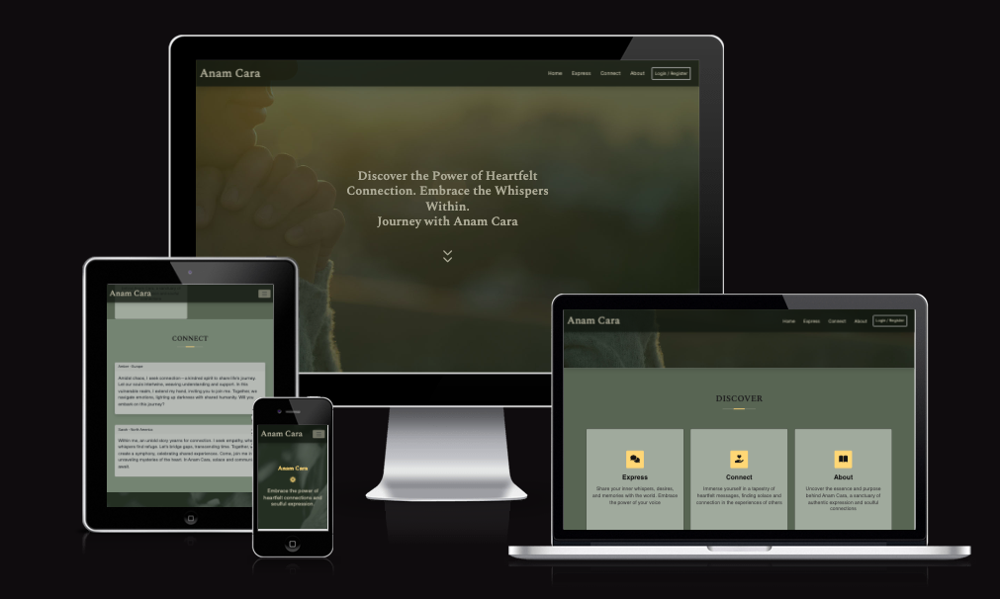
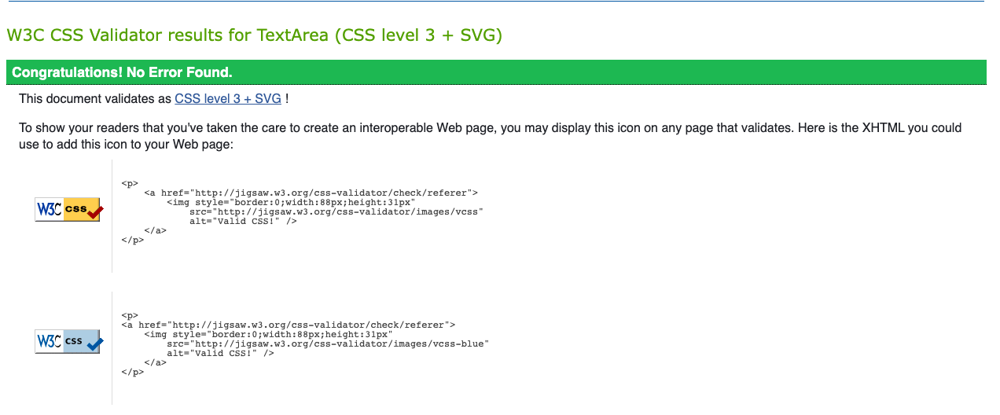
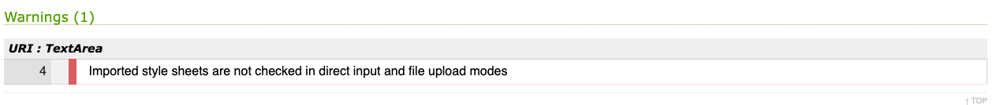
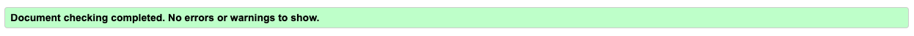

# Anam Cara - Testing

## Table of Contents

- [Test Record](#testrecord)
- [CSS3 Validator](#css)
- [HTML5 Validator](#html)
- [JavaScript Validator](#js)
- [Python Validator](#python)
- [Accessibility](#access)
- [Compatibility](#compatibility)
- [Performance](#performance)
- [User Story](#user)
- [Known Bugs](#bugs)

## Test Record :
**TEST** | **ACTION** | **EXPECTATION** | **RESULT** 
----------|----------|----------|----------
 Home page | Size to 320px using Chrome Dev Tools	| Elements look good @ 320px | Works as expected
Home page | Size to 1920px using Chrome Dev Tools | Elements look good 1920px | Works as expected
Home page | Size to 990px using Chrome Dev Tools | Navbar to toggle | Works as expected
Home page | Scroll action | NavBar Scrolls with user | Works as expected
Home page | Header Nav links clicked |  User taken to respective correct pages | Works as expected
Home page | Size to 990px & Toggle Nav links clicked |  User taken to respective correct pages | Works as expected
Home Page | Footer Nav links clicked | User taken to respective correct pages | Works as expected
Home page |Header Logo Text clicked | User taken to Home page | Works as expected
Home page | Downward chevron icon clicked | Take user to the Discover section | Worked as expected
Home page | link clicked on Express link in discover section | Take user to login prompt or if logged in to the express form | Worked as expected
Home page | link clicked on Connect link in discover section | Take user to Connect page | Worked as expected
Home page | link clicked on About link in discover section | Take user to About page | Worked as expected
About page | Size to 320px using Chrome Dev Tools	| Elements look good @ 320px | Works as expected
About page | Size to 1920px using Chrome Dev Tools | Elements look good 1920px | Works as expected
About page | Downward chevron icon clicked | Take user to the Who We Are section | Worked as expected
About page | Size to 990px using Chrome Dev Tools and toggle links clicked | NavBar to toggle and links take user to respective correct pages | Works as expected
About page | Scroll action | NavBar Scrolls with user | Works as expected
About page | Header Nav links & Logo Text clicked |  User taken to respective correct pages | Works as expected
Connect page|Size to 320px using Chrome Dev Tools	| Elements look good @ 320px | Works as expected
Connect page|Size to 1920px using Chrome Dev Tools | Elements look good 1920px | Works as expected
Connect page|Size to 990px using Chrome Dev Tools and toggle links clicked | NavBar to toggle and links take user to respective correct pages | Works as expected
Connect page | Header Nav links & Logo Text clicked |  User taken to respective correct pages | Works as expected
Connect page| Clicks Express You Heart Button | Takes User to Login or if already logged in to Express page | Works as expected
Connect page| User not logged in - Scroll to view & read messages left by users | Messages appear - No Update or Delete buttons seen | Works as expected
Connect page| User logged in - Scroll to view messages left by users | Messages appear and Users own messages now have Update & Delete buttons displayed | Works as expected
Connect page| User Logged in - click Update button on users own message | Update form appears pre populated |Works as expected
Connect page| User Logged in updating form- Clicks Submit Update button |  User redirected to Connect page and updated message appears |Works as expected
Connect page| User Logged in - click Delete Trash Can button on users own message | Delete Modal appears to confirm deletion |Works as expected
Connect page|User Logged in - clicks Cancel button on the Delete modal | Delete Cancelled redirected back to message |Works as expected
Connect page|User Logged in - clicks Delete button on the Delete modal | Message deleted user redirected back to Connect page |Works as expected
Express page|Size to 320px using Chrome Dev Tools	| Elements look good @ 320px | Works as expected
Express page|Size to 1920px using Chrome Dev Tools | Elements look good 1920px | Works as expected
Express page|Size to 990px using Chrome Dev Tools and toggle links clicked | NavBar to toggle and links take user to respective correct pages | Works as expected
Express page | Header Nav links & Logo Text clicked |  User taken to respective correct pages | Works as expected
Express page | User not logged in - Navigate to Express page | Login form shown with invitation to login to view page | Works as expected
Express page | User logged in - Navigate to Express page | Express form shown | Works as expected
Express page | User inputs Text into Name field | Data Enters min 3 - max 60 and required elements flagged when not met or exceeded | Works as expected
Express page | User selects Continent | Data Entered - required elements flagged when not met | Works as expected
Express page | User selects Today's Date | Date Entered - required elements flagged when not met | Works as expected
Express page | User inputs text into Title field | Data Enters min 5 - max 60 and required elements flagged when not met or exceeded | Works as expected
Express page | User inputs text into Message field | Data Enters min 100 - max 1000 and required elements flagged when not met or exceeded | Works as expected
Express page | User inputs text into Connect field | Data Enters min 3 - max 70 elements flagged when not met or exceeded | Works as expected
Express page | User selects Publish Date | Date Entered - required elements flagged when not met | Works as expected
Login page| Size to 320px using Chrome Dev Tools	| Elements look good @ 320px | Works as expected
Login page| Size to 1920px using Chrome Dev Tools | Elements look good 1920px | Works as expected
Login page| Size to 990px using Chrome Dev Tools and toggle links clicked | NavBar to toggle and links user to the respective correct pages | Works as expected
Login page| Header Nav links & Logo Text clicked |  User taken to respective correct pages | Works as expected
Login page| User inputs valid username and password | User taken to Connect page successful login message displayed and button to Express Your Heart now takes user to Express Form | Works as expected
Login page| User inputs valid username and password | Navigation bar Login/Register button changes to a Logout option | Works as expected
Login page| User inputs in-valid username and password | Flash message appears to highlight they have entered an invalid username or password  | Works as expected
Sign Up page| Size to 320px using Chrome Dev Tools	| Elements look good @ 320px | Works as expected
Sign Up page| Size to 1920px using Chrome Dev Tools | Elements look good 1920px | Works as expected
Sign Up page| Size to 990px using Chrome Dev Tools and toggle links clicked | NavBar to toggle and links Sign Up to respective correct pages | Works as expected
Sign Up page| Header Nav links & Logo Text clicked |  User taken to respective correct pages | Works as expected
Sign Up page| User inputs username and password | user redirected to login page saying success and inviting them to use their new credentials to login | Works as expected - Database checked password is successfully hashed
Logout NavBar Button| Logged in user clicks to logout | User logged out and redirected to the home page successful logout message displayed | Works as expected

## CSS3 validator - Pass
One Warning - line 4 - Imported style sheets are not checked in direct input and file upload modes

## HTML5 validator
- base.html - Passed with removal of all Jinja Templating and Static URLS
- home.html - Passed with removal of all Jinja templating and Static URLS with warnings regarding missing doctype contained in the base.html
- About.html - Passed with removal of all Jinja templating with warnings regarding missing doctype contained in the base.html
- 

## Javascript validator
- 
- 

## Python validator
- 
- 
  

## Accessibility

### Lighthouse testing
- 
- 
- 

## Compatibility Testing
- Browser Compatibility tested via [Browser Stack](https://live.browserstack.com/) 
- tested on the latest versions of the following
    | Safari    | Firefox   | Chrome  | Opera  | Edge  |
    | --------- |:---------:| -------:| ------:| -----:|
    | Pass      | Pass      | Pass    | Pass   | Pass  | 
    
- Chrome developer tools has been used to check the responsiveness of the site across different screen sizes and devices. 
- The site has mostly been built and tested on a Macbook Air operating on MacOs Catalina.

## Performance Testing
-  The performance of the site was tested on the following site with satisfactory results. [Web Page Test](https://www.webpagetest.org)

## Testing User Stories 
>### External testing
- All testers confirmed that they coud sign up, login and logout.
- All testers confirmed that all buttons and navigation links performed the correct function.
- All testers confirmed that the forms submitted and messages displayed correctly.
- All testers confirmed that they could read messages, update and delete their messages.

>### User Stories - Customer
- From user story 1;
    - Community message board created providing a space for likeminded individuals to connected and foster meaningful and supportive interactions.
    - Users able to login and edit or delete messages should they change their mind.
    - Users able to scroll through the message board to read and reflect on their previous messages and personal growth.
    - the implementation of a 100 minimum requirement within the text area means that the user needs to take their time and really express in detail how they are feeling rather than quick messages with no thought behind them. The selection of a Publish Date takes the immediacy out of the posting. Both of these elements work together to create a slower less intrusive way of expressing yourself and connecting.

- From user story 2;
     - The structure of the site has been kept to a traditional interface meaning that the user does not have to think about how they navigate to where they want to go. Nav links at the top and the bottom of the page along with the Discover links funnel the user to the correct pages. All restricted pages invite the user to login and once the user has actioned logging in, out, signing up or submitting, updating or deleting a message they are redirected intuitively to relevant next page for them.
    - The selected Publish date allows users to choose when they publish their message.
    - The Colour palette has been specifically chosen to create a tranquil peaceful experience whilst still retaining the modern Celtic vibe in line with the brand. The use of colours behind the messages and lack of imagery mean that the messages remain the focus of the connect page.
    - There is a free text section where people can choose to input their contact details or choose to leave it blank - this is the only field within the form that is not required in order to fulfil this user request.

- From user story 3;
    - There is a free text section where people can choose to input their contact details or choose to leave it blank - this is the only field within the form that is not required in order to fulfil this user request.
    - The delayed posting/schedule feature of the messages and once a day release of the scheduled posts fosters the slow reading and once a day visits rather than endless scrolling. The newest messages appear at the top to ensure users are not scrolling through countless messages to review the most recent.
    - Comments are not enabled in this version and contact details are optional to share limiting trolls or attacks on certain posts. 
    - The messages and profiles have been kept image free to foster love and friendship at a spiritual level before material judgement

>### User Stories - Business Owner
-  The brand ethos and values have been incorporated into the messaging styling of the site. All users stories have been met to create the requested type of environment where the user would feel safe to freely make meaningful connections.
- All passwords have been hashed for security. There are elements of defensive programming protecting the user from accidentally deleting their own content and we have implemented user authorisation for access to the update and delete functions of the messages. 
- The beta test version of Anam Cara captures its core values and provides the raw facility needed to post messages and start garnering a community. This provides the business with the ability to watch how their community utilises the site and listen to feedback about additional features the community would like. Creating a solid base allows the business to equate what features they can add and use to scale the community in a sustainable way. 

## Known Bugs

- At the time of submission there are no known bugs within the site.

## Bugs & challenges experienced during the build

- The largest challenge faced was the inability to migrate my database changes half way through the build. I built out the basic CRUD function first and foremost and only when i was happy with that did i attempt to add user authentication. The additional table for the user data migrated organically through git push however the additional user_id column added to the original Note table did not migrate. After endless attempts to update and migrate the database to Heroku/ElephantSQL i took the decision to delete the ElephantSQL instance and Heroku App and work through the deployment steps again. This has fixed the bug. Deletion of Heroku & ElephantSQL linked to your app is not recommended due to the data loss implications, however in this instance the data base was blank and so posed not risk to the build. 

- The addition of the Delete Modal in the notes.html allowing the bootstrap modal to pop up when the trash can icon was selected appeared to create a bug within the code. On closer inspection the Delete Modal was not within the for loop and it did not have not_id associated with it. This was picked up by Jason on tutoring support. Once the issue was discovered I moved the Delete modal into the for loop, setting the delete button to call the delete route and pass the note_id value. This rectified the delete bug and restored the Delete function.

- All Flash messages functioned as expected apart from the flash to flag an invalid username or password at login. This was resolved by duplicating the else statement to show the message for both an incorrect username or password without disclosing to the user which field was inputted incorrectly.

- I experienced issues with implementing a Jinja Templating filter to allow the messages to appear in reverse order. After further research i discovered to effect this change i only needed to make a change within the routes.py file, creating a descending query order. 

- Initially the form was not passing the submission date information to the database. On further inspection the name, ID & value had an extra note_ at the start of them. This was removed and the input functioned correctly. 